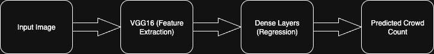

# Crowd Counting & Density Estimation using VGG16

This project estimates **crowd size** from images and categorizes **risk zones** (Low, Medium, Moderate, High).  
It uses **transfer learning with VGG16** and a **regression head** to predict the number of people in an image.

---

## 📊 Workflow


1. **Data Preprocessing** – images are resized, normalized, and augmented.  
2. **Feature Extraction** – VGG16 (pre-trained on ImageNet) extracts image features.  
3. **Regression Head** – Dense layers map features → predicted crowd count.  
4. **Evaluation** – Mean Absolute Error (MAE) is used as the main metric.  
5. **Risk Zoning** – based on count thresholds, crowd density is categorized.

---

## 📊 Workflow Diagram



---

## 📂 Project Structure
```
crowd-counting/
├── crowd_counting.ipynb 
├── requirements.txt
├── README.md
├── .gitignore=
└── assets/
  └── crowd_counting_flow.png 
```

---

## ⚙️ Setup & Installation

### 1. Clone the repository
```bash
git clone https://github.com/<your-username>/crowd-counting.git
cd crowd-counting
```

2. Create a virtual environment
```bash
python -m venv .venv
# Activate
# Windows: .venv\Scripts\activate
# macOS/Linux:
source .venv/bin/activate
```

3. Install dependencies
```bash
pip install -r requirements.txt
```

4. Run Jupyter Notebook
```bash
jupyter notebook
```

---
## 📈 Results

- The model successfully learns to **predict crowd counts** from images using transfer learning with VGG16.  
- Performance is measured using **Mean Absolute Error (MAE)**:  
  - **MAE** = average difference between predicted count and actual ground truth.  
  - A **lower MAE** indicates better performance.  

---


## 🔮 Future Improvements

- Use **Density Map Estimation** instead of regression → gives spatial distribution of people.
- Try **modern architectures** like EfficientNet, Vision Transformers (ViT).
- Deploy as a real-time web app with live CCTV/Drone feed integration.
- Use **YOLO/Detectron2** for object detection + crowd counting hybrid approach.

---

## 🙏 Acknowledgements

- **VGG16** pre-trained model from [Keras Applications](https://keras.io/api/applications/).  
- Crowd datasets such as **Shanghaitech**, **UCF_CC_50**, and similar resources that inspired this project.  
- **Kaggle** for providing the notebook environment and GPU resources for experimentation.  


---

## 📜 License

This project is licensed under the **MIT License**.  
You are free to use, modify, and distribute it with proper attribution.  
